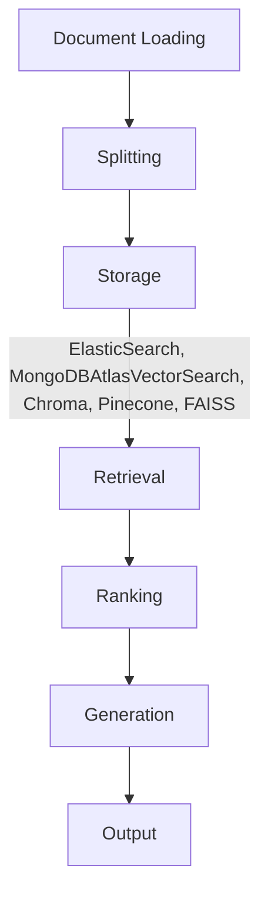

## 📖 Unsloth.ai

- Unsloth.ai: Easy finetuning for AI and LLMs: datasets.jsonl -> model.gguf
- Apache Parquet

## 📖 Use Cases for Parquet (HF datasets)

When working with very large amounts of data, Parquet’s performance and compression benefits are valuable.
For data lakes, where it’s essential to balance query performance and storage efficiency.

## 📖 LanceDB

The Database for multimodal AI

## 📖 Hugging Face

- Pipeline
- NLP Tasks
- **Tokenization**: translate text into numbers
- Fine-tuning Model
- Datasets & Spaces
- Transformers
- Model Hub

## 📖 [Building LLM apps with LangChian: ElasticON AI](https://www.youtube.com/watch?v=V05ieC9o0jQ)

### RAG

