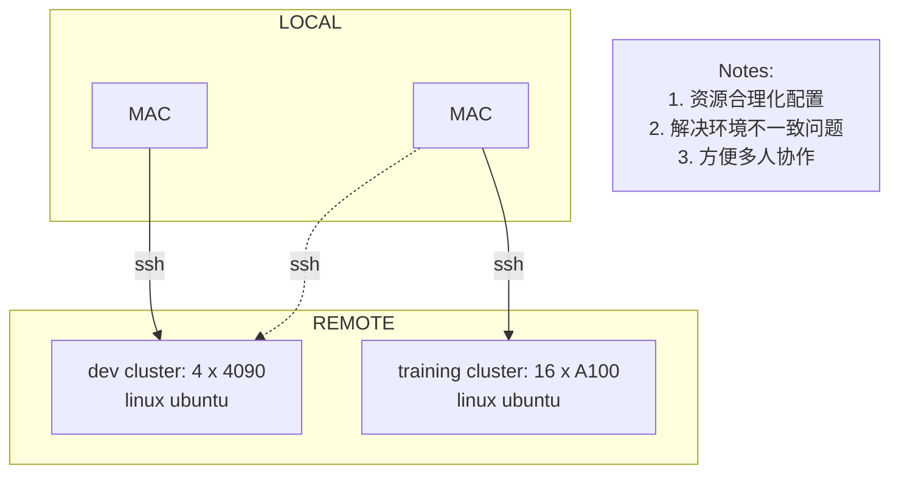

## 🥃 1. AI development practise

- AI应用开发：将已有的算法进行落地及应用 参考 llama.cpp, llama-factory, vllm

### 🥃 AI project

- configs: 配置文件
- src: 核心代码文件
- tools: 独立的执行功能
- utils: 多个模块可复用的功能
- scripts: 一键脚本（启动、停止、打包）
- assets: 项目相关资源 (logo)
- resources: 训练数据 (raw)
- data: 训练数据 (formatted data for train)
- docs: 说明文档
- weights: 模型权重
- logs: 项目运行日志，模型训练日志
- readme.md: 说明文件
- Dockerfiles: Docker 配置文件
- requirements.txt: Python 安装库

### 🥃 AI Dev Env

### 🥃 example: [听舒](https://github.com/echonoshy/tingshu)

## 🥃 2. How to Use AI to Develop Large-Scale Software

## 🥃 

## 🥃 Nvidia Series (Edge)

| Feature            | RTX 4090                         | A100                              | H100                              | H200                              |
|--------------------|----------------------------------|-----------------------------------|-----------------------------------|-----------------------------------|
| **Architecture**   | Ada Lovelace                     | Ampere                            | Hopper                            | Hopper                            |
| **CUDA Cores**     | 16,384                           | 8,192                             | 10,240                            | 12,288                            |
| **Memory**         | 24 GB GDDR6X                     | 40 GB HBM2                        | 80 GB HBM3                        | 120 GB HBM3                       |
| **Memory Bandwidth**| 1 TB/s                          | 1.6 TB/s                          | 3.2 TB/s                          | 4.8 TB/s                          |
| **TDP**            | 450 W                            | 250 W                             | 350 W                             | 500 W                             |
| **Release Date**   | September 2022                   | April 2020                        | Expected 2024                     | Expected 2025                     |
| **Target Market**  | High-end gaming, AI              | AI, HPC                           | AI, HPC                           | AI, HPC                           |

## 🥃 Nvidia Series (Perplexity)

| Feature                   | NVIDIA RTX 4090          | NVIDIA A100 (80 GB)     | NVIDIA H100 (80 GB)     | NVIDIA H200              |
|---------------------------|--------------------------|--------------------------|--------------------------|--------------------------|
| Architecture              | Ada Lovelace             | Ampere                   | Hopper                   | Hopper                   |
| Launch Date               | October 12, 2022        | June 22, 2020            | March 21, 2023          | Expected Q2 2024        |
| CUDA Cores                | 16,384                   | 6,912                    | 16,896                   | TBD                      |
| Memory Type               | GDDR6X                   | HBM2e                    | HBM3e                   | HBM3e                   |
| Memory Size               | 24 GB                    | 80 GB                    | 80 GB                    | 141 GB                  |
| Memory Bandwidth          | 1,018 GB/s               | 2,039 GB/s               | 3,039 GB/s               | 4,800 GB/s              |
| FP16 Performance (TFLOPS) | ~82.6                    | ~78                      | ~204.9                   | TBD                      |
| FP32 Performance (TFLOPS) | ~82.6                    | ~19.5                    | ~51.2                    | TBD                      |
| FP64 Performance (TFLOPS) | ~1.3                     | ~9.7                     | ~25.6                    | TBD                      |
| TDP                       | 450 W                    | 250 W                    | 350 W                    | ~700 W                  |
| Die Size                  | 608 mm²                  | 826 mm²                  | 814 mm²                  | TBD                      |

## 🥃 

## 🥃 

## 🥃 