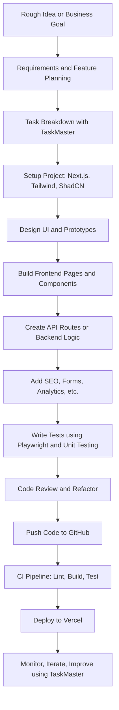

# Next.js Project Planning & Development Workflow: A Comprehensive Guide

This guide provides a detailed workflow for planning and developing a professional-grade Next.js application, using a software outsourcing services website as an example. It covers everything from initial ideation to deployment and maintenance, with a focus on modern tools and best practices.

## Key Takeaways

*   **Plan Thoroughly:** Before writing any code, invest time in clarifying requirements, defining the scope, and creating a detailed project plan.
*   **Use a Modern Tech Stack:** Leverage the power of Next.js, TypeScript, Tailwind CSS, and other industry-standard tools to build a robust and maintainable application.
*   **Embrace AI-Powered Tools:** Utilize AI assistants like GitHub Copilot, TaskMaster, and Context7 to streamline your workflow, generate code, and manage tasks more efficiently.
*   **Follow an Iterative Workflow:** Adopt an Agile-like approach with sprints, regular reviews, and continuous integration/deployment to ensure a high-quality outcome.
*   **Prioritize Testing:** Implement a comprehensive testing strategy with both end-to-end and unit/integration tests to catch bugs early and maintain code quality.
*   **Deploy with Confidence:** Use Vercel and GitHub Actions to automate your deployment pipeline and ensure a seamless and reliable release process.

## 1. Ideation and Requirements Analysis

The foundation of any successful project is a clear understanding of its goals and requirements.

*   **Clarify Purpose and Audience:** Define the primary objective of the application and identify the target users.
*   **List Core Features:** Create a comprehensive list of all necessary pages and features (e.g., Home, Services, Portfolio, About, Contact Form, Blog).
*   **Conduct Market Research:** Analyze competitor websites, gather user feedback, and identify "must-have" vs. "nice-to-have" features.
*   **Prioritize MVP:** Define a Minimum Viable Product (MVP) with a core set of features to launch quickly and gather feedback.
*   **Document Requirements:** Create a Product Requirements Document (PRD) or a detailed outline to document all project requirements.
*   **Break Down Tasks:** Use brainstorming tools (mind maps, spreadsheets) to break down the project into smaller, manageable tasks and user stories.
*   **Use a Task Manager:** Employ a task management tool like **TaskMaster** to create a structured list of tasks and track their progress.
*   **Categorize Tasks:** Organize tasks into logical categories such as Frontend/UI, Backend/API, DevOps/CI-CD, and Testing.

## 2. Tools for Prompts and Task Management

Leverage AI-powered tools to enhance your productivity and streamline your workflow.

*   **TaskMaster (AI Task Manager):** An AI-driven tool that converts a PRD into a structured list of tasks, helping you manage dependencies and track progress.
*   **Boost Prompt (VS Code Extension):** A Visual Studio Code extension that enriches your AI prompts with technical context, leading to higher-quality code generation from tools like GitHub Copilot.

## 3. Development Workflow Steps

Follow these iterative steps to move your project from concept to deployment.

1.  **Project Setup:**
    *   Initialize your Next.js project with TypeScript: `npx create-next-app@latest --typescript`
    *   Configure **Tailwind CSS** for styling.
    *   Set up a UI library like **shadcn/ui**.
    *   Establish code formatting and linting with **ESLint** and **Prettier**.

2.  **Design & Prototyping:**
    *   Create wireframes and mockups using tools like **Figma**.
    *   Define your branding, including color themes and typography.

3.  **Feature Implementation:**
    *   Build the core UI and pages using Next.js pages/routes.
    *   Utilize **shadcn/ui** components to accelerate UI development.
    *   Leverage **Tailwind CSS** utility classes for rapid and customizable styling.

4.  **Backend & Data:**
    *   Set up APIs using Next.js API routes or a separate backend service.
    *   Choose the appropriate rendering strategy: Static Site Generation (SSG), Server-Side Rendering (SSR), or Incremental Static Regeneration (ISR).
    *   Consider using a headless CMS (e.g., **Strapi**, **Sanity**, **Contentful**) for managing dynamic content.

5.  **Integrations:**
    *   Add analytics, SEO metadata, and contact forms.
    *   Integrate with email or CRM APIs for form submissions.

6.  **Testing:**
    *   Write end-to-end (E2E) tests with **Playwright** to automate browser testing.
    *   Implement unit and integration tests with **Jest** or **Vitest**.

7.  **Review & Iteration:**
    *   Manually review all generated code and suggestions from AI assistants.
    *   Use tools like **Context7** to get up-to-date documentation and **Sequential Thinking** to break down complex logic.
    *   Refine your code based on test results and feedback.

8.  **Deployment:**
    *   Push your code to **GitHub**.
    *   Set up **GitHub Actions** for Continuous Integration (CI) to lint, build, and test your code on each push.
    *   Configure automatic deployment to **Vercel** for seamless releases.

9.  **Monitoring & Maintenance:**
    *   Monitor your application's performance after launch.
    *   Fix any bugs that arise and plan for future feature updates.
    *   Keep your documentation and dependencies up-to-date.

## 4. Recommended Tech Stack and Tools

Choose these industry-standard tools to build a professional and scalable application.

*   **Framework:** **Next.js** (React)
*   **Language:** **TypeScript**
*   **Styling:** **Tailwind CSS**, **shadcn/ui**
*   **Editor:** **Visual Studio Code** + **GitHub Copilot**
*   **Version Control:** **GitHub**
*   **Deployment:** **Vercel**
*   **Task Management:** **TaskMaster**
*   **AI Assistants:** **Context7**, **Sequential Thinking**
*   **Testing:** **Playwright**
*   **Authentication:** **NextAuth.js**
*   **CMS:** Headless CMS (**Strapi**, **Sanity**, **Contentful**)
*   **Code Quality:** **ESLint**, **Prettier**
*   **Error Tracking:** **Sentry**

## 5. Development Workflow Checklist

Use this checklist to track your progress throughout the development lifecycle.

### Phase 1: Planning and Setup
- [ ] Clarify project requirements and create a PRD.
- [ ] Define the MVP and prioritize features.
- [ ] Create a task list using TaskMaster or another tool.
- [ ] Set up the Next.js project with TypeScript and Tailwind CSS.
- [ ] Configure ESLint, Prettier, and other development tools.
- [ ] Create wireframes and mockups in Figma.

### Phase 2: Development and Implementation
- [ ] Build the core UI components with shadcn/ui and Tailwind CSS.
- [ ] Implement the main pages and routing.
- [ ] Develop backend functionality with Next.js API routes.
- [ ] Integrate with a headless CMS for dynamic content.
- [ ] Add integrations for analytics, SEO, and forms.

### Phase 3: Testing and Quality Assurance
- [ ] Write unit and integration tests for all major features.
- [ ] Create E2E tests with Playwright to cover critical user flows.
- [ ] Perform manual testing and code reviews.
- [ ] Ensure the application is responsive and accessible.

### Phase 4: Deployment and Maintenance
- [ ] Set up a CI/CD pipeline with GitHub Actions and Vercel.
- [ ] Deploy the application to a staging environment for final testing.
- [ ] Launch the application to production.
- [ ] Monitor the application for errors and performance issues.
- [ ] Plan for future updates and maintenance.

---
*This document was boosted by Gemini to improve its structure, readability, and practical utility.*

## 📝 Product Requirements Document (PRD) – SME Outsourcing Website

### 1. Business Overview
- Provide software development and consulting services to global clients
- Target: Startups, SMEs, agencies in North America and Asia

### 2. Key Pages
- Home
- Services
- Portfolio / Case Studies
- Team / About
- Contact (form + map)
- Blog (optional)

### 3. Features
- Mobile-responsive design (TailwindCSS)
- Reusable components (shadcn/ui)
- Email form with spam protection
- SEO optimization (Next.js)
- CI/CD pipeline (GitHub → Vercel)

## 🛠 Development Workflow Steps (Mermaid Diagram)

### 📝 Notes

- **TaskMaster** is used at both planning and iteration phases.
- **Boost Prompt** and **Context7** assist throughout development (especially at coding stages).
- **SequentialThinking** is used during implementation and refactoring for better logic decomposition.
- **Playwright** is introduced during testing.
- **Vercel** handles staging and production deployments automatically.
