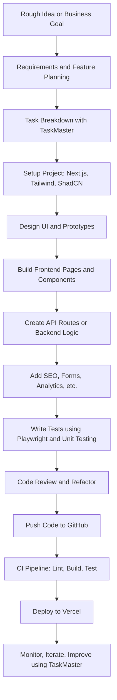

# Next.js Project Planning & Development Workflow: A Comprehensive Guide

This guide provides a detailed workflow for planning and developing a professional-grade Next.js application, using a software outsourcing services website as an example. It covers everything from initial ideation to deployment and maintenance, with a focus on modern tools and best practices.

## 📝 Product Requirements Document (PRD) – SME Outsourcing Website

### 1. Business Overview

- Provide software development and consulting services to global clients
- Target: Startups, SMEs, agencies in North America and Asia

### 2. Key Pages

- Home
- Services
- Portfolio / Case Studies
- Team / About
- Contact (form + map)
- Blog (optional)

### 3. Features
- Mobile-responsive design (TailwindCSS)
- Reusable components (shadcn/ui)
- Email form with spam protection
- SEO optimization (Next.js)
- CI/CD pipeline (GitHub → Vercel)

## 🛠 Development Workflow Steps (Mermaid Diagram)

### 📝 Notes

- **TaskMaster** is used at both planning and iteration phases.
- **Boost Prompt** and **Context7** assist throughout development (especially at coding stages).
- **SequentialThinking** is used during implementation and refactoring for better logic decomposition.
- **Playwright** is introduced during testing.
- **Vercel** handles staging and production deployments automatically.
