### 🥃 gitingest, gitmcp vs. ref, context7

| Aspect           | MCP servers (ref, context7)               | gitingest                      | gitmcp                                  |
|------------------|-------------------------------------------|--------------------------------|-----------------------------------------|
| Protocol         | Full MCP protocol (dynamic client-server) | None - static ingestion file   | MCP protocol - repo-focused live server |
| Interaction Mode | Real-time queries via API/SSE/JSON-RPC    | Static text file for LLM input | Dynamic API for repo data               |
| Deployment       | Remote or local                           | Local tool                     | Remote MCP server                       |
| Use Case         | General AI tool/data integration          | Bulk repo-to-text conversion   | Live repo context serving               |
| Flexibility      | Highly flexible & extensible              | Limited to digest generation   | Specialized to GitHub repos             |
| Security & Auth  | Standard OAuth/token-based                | User-managed locally           | Provider managed auth                   |

### 🥃 Agentic AI

```mermaid
flowchart LR
    P[Perceive感知] --> R[Reason推理]
    R --> A[Act行动]
    A --> O[Observe观察]
    O --> P
```

- Travel Agent
- Data Analyst
- DevOps engineer

### 🥃 Large Reasoning (大规模推理) Model

- Chain of Thoughts, Thinking, Ultra Think

### 🥃 ASI (Artificial Super-Intelligence)

### 🥃 Agent

- Automation = predefined, fixed steps
- Agent = dynamic, flexible, and capable of reasoning

1. Brain (LLM)
2. Memory
3. Tools: 
      1. Retrieving data or context: search web, pull docs
      2. Taking Action: update db, create calendar event, send email
      3. Orchestration: call other agents, trigger workflows, chain actions

## 🥃 

## 🥃 NotebookLM

## 🥃 Obsidian

PKM: personal knowledge management 

## 🥃 Notion

- **For research, AI-driven insights, and doc analysis**: NotebookLM is unmatched.
- **For cross-device, project, and team workspaces**: Notion provides the most flexibility and collaborative power.
- **For personal, privacy-first PKM and long-term knowledge graph building**: Obsidian stands out.

### 🥃 Obsidian vs Notion vs logseq

| Feature/Tool        | **Obsidian**               | **Notion**                      | **Logseq**                    |
|---------------------|---------------------------|----------------------------------|-------------------------------|
| **Data Storage**     | Local (Markdown files)    | Cloud-based                     | Local (Markdown/Org files)    |
| **Collaboration**    | Limited (via plugins)     | Excellent                        | Limited                       |
| **Offline Access**   | Fully offline             | Limited                          | Fully offline                 |
| **Customizability**  | Extensive (via plugins)   | High (via templates/databases)   | Moderate (via settings/plugins) |
| **Graph View**       | Yes                       | No                               | Yes                           |
| **Ease of Use**      | Moderate                  | Easy                             | Moderate                      |
| **Best For**         | Knowledge management      | Team collaboration & databases   | Privacy-focused outliners     |

## 🥃 Discord

## 🥃 Typora, Macdown

## 🍍

## 🥥

## 🥝

