## 🥃 gitingest, gitmcp vs. ref, context7

| Aspect           | MCP servers (ref, context7)               | gitingest                      | gitmcp                                  |
|------------------|-------------------------------------------|--------------------------------|-----------------------------------------|
| Protocol         | Full MCP protocol (dynamic client-server) | None - static ingestion file   | MCP protocol - repo-focused live server |
| Interaction Mode | Real-time queries via API/SSE/JSON-RPC    | Static text file for LLM input | Dynamic API for repo data               |
| Deployment       | Remote or local                           | Local tool                     | Remote MCP server                       |
| Use Case         | General AI tool/data integration          | Bulk repo-to-text conversion   | Live repo context serving               |
| Flexibility      | Highly flexible & extensible              | Limited to digest generation   | Specialized to GitHub repos             |
| Security & Auth  | Standard OAuth/token-based                | User-managed locally           | Provider managed auth                   |

## 🥃 Agentic AI

```mermaid
flowchart LR
    P[Perceive感知] --> R[Reason推理]
    R --> A[Act行动]
    A --> O[Observe观察]
    O --> P
```

- Travel Agent
- Data Analyst
- DevOps engineer

## 🥃 Large Reasoning (大规模推理) Model

- Chain of Thoughts, Thinking, Ultra Think

## 🥃 ASI (Artificial Super-Intelligence)

## 🥃 Agent

- Automation = predefined, fixed steps
- Agent = dynamic, flexible, and capable of reasoning

1. Brain (LLM)
2. Memory
3. Tools: 
      1. Retrieving data or context: search web, pull docs
      2. Taking Action: update db, create calendar event, send email
      3. Orchestration: call other agents, trigger workflows, chain actions

## 🥃 自动化获取视频内容: yt-dlp, tartube 

1批量下载，2.音频转文字，3.文本翻译，4.制作数据集，5.本地部署知识库

## 🥃 Obsidian

- PKM: personal knowledge management 
- Storage & Connection

## 🥃 Google NotebookLM

## 🥃 Notion

- `notion mcp`
- **For research, AI-driven insights, and doc analysis**: NotebookLM is unmatched.
- **For cross-device, project, and team workspaces**: Notion provides the most flexibility and collaborative power.
- **For personal, privacy-first PKM and long-term knowledge graph building**: Obsidian stands out.

## 🥃 Obsidian vs Notion vs logseq

| Feature/Tool        | **Obsidian**               | **Notion**                      | **Logseq**                    |
|---------------------|---------------------------|----------------------------------|-------------------------------|
| **Data Storage**     | Local (Markdown files)    | Cloud-based                     | Local (Markdown/Org files)    |
| **Collaboration**    | Limited (via plugins)     | Excellent                        | Limited                       |
| **Offline Access**   | Fully offline             | Limited                          | Fully offline                 |
| **Customizability**  | Extensive (via plugins)   | High (via templates/databases)   | Moderate (via settings/plugins) |
| **Graph View**       | Yes                       | No                               | Yes                           |
| **Ease of Use**      | Moderate                  | Easy                             | Moderate                      |
| **Best For**         | Knowledge management      | Team collaboration & databases   | Privacy-focused outliners     |

## 🥃 Discord

## 🥃 Typora, Macdown

## 🍍 Domains

- hostinger -> 2
- vercel -> williamjxj@gmail.com, jxjwilliam@gmail.com
- cloudflare R2 -> williamjxj@gmail.com
- Pixabay -> API
- Pexels -> API
- Unsplash -> API
- supabase -> 2 per email: williamjxj@gmail.com, jxjwilliam@gmail.com, jxjwilliam@hotmail.com, jxjwilliam@sina.com
- notebookLM

## 🥝 Vite

- is a modern **frontend build tool** and **development server**. (replacer of Webpack)
- Extremely fast **HMR (Hot Module Replacement)**
- deal for SPAs and static sites.

## 🥥 Remix

- full-stack React framework (like Next.js)
- React +  Vite (SPA) + Remix (SSR/CSR)

## 🥥 Integration Tip (as Full-Stack Engineer)

- If you want a **lightweight frontend**:  
    → Use **Vite + React** + API backend (e.g., Express/GraphQL).
    
- If you want **SSR + unified routing + better SEO**:  
    → Use **Remix** (or Next.js if you prefer more ecosystem maturity).

## 🥥 Full-stack frameworks

- Next.js -> Vercel
- React Router + Remix -> Shopify
- Expo: **a React framework that lets you create universal Android, iOS, and web apps with truly native UIs**
- TanStack

## 🥥 Remix + Vite

`npx create-remix@latest my-remix-vite-app`

