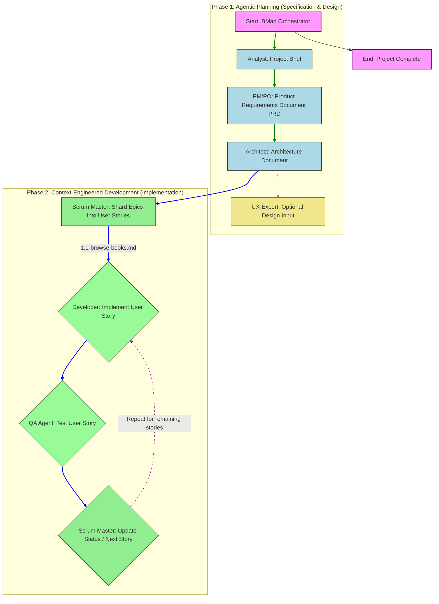

# BMAD-METHOD

- "Breakthrough Method for Agentic Development” or “Breakthrough Method for Agile AI-Driven Development.”
- Agentic (代理的; 代理的，像代理人的；（心理学）代理人的，服从权威的；（心理学）与表现或地位有关的；（心理学）主体的) Planning
- Context-Engineered Development

## Agents

- analyst
- architect
- bmad-master
- bmad-orchestrator
- dev
- pm
- po
- qa
- sm
- ux-expert

