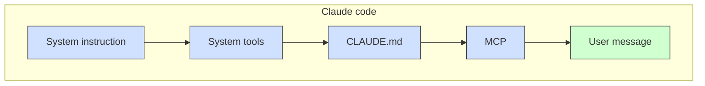

# 🌐 AI Jason

## 🍒🍒 ["I want Llama3 to perform 10x with my private knowledge" - Local Agentic RAG w/ llama3](https://www.youtube.com/watch?v=u5Vcrwpzoz8&t=36s)

1. RAG (webpages): LlamaParse vs PyPDF
2. LangGraph (langchain, chromdb, tavily-python, firecrawl-py)
3. Ollama (LLama 3.2)

Explanation:

- FireCrawl: convert the webpage to markdown data.
- Chunk size
- Rerank
- Hybrid search
- Agentic (代理的) RAG
    * Query translation/planning
    * metadata filter/routing
    * Corrective RAG Agent

### 🥃 Json schema vs. Pydantic

### 🥃 OpenAI Structured Output

- Complex data extraction
- Boosted reasoning, CoT: Chain of thoughts
- Reliable Agentic workflow

## 🍒🍒 Train Your own GPT

How to handle LLM token limits (4096) ?

(1) Summary: e.g. Map reduce
(2) Vector search: e.g. Search for relevant content

## 🍒🍒 HuggingFace and LangChain Tutorial

Image - Text - Speech (HF + LangChain)

- Image-to-Text Model: Clip
- Language Model: LangChain
- Text-to-Speech Model: Wav2Vec2
- Streamlit for UI

## 🍒🍒 Build AI Companion

- Langchain + Elevenlabs + Whispr + Flask

## 🍒🍒 Personal Assistant AI Agent

gmail

## 🍒🍒 Best Cusor Workflow (r/ollama, r/openai)

```text
# Project overview
You are building a Reddit analytics platform, where users can get analytics of different sub reddits, where they can see top contents & see category of posts;

You will be using NextJS 14, shadcn, tailwind CSS, Lucid icon

# Core functionalities
1. See list of available sub reddits & add new sub reddits
    1. Users can see list of available sub-reddits that is already created display in cards, common ones like "ollama", "openai"
    2. Users can clicking on an add reddit button, which should open a modal for users to paste in reddit url and add
    3. After users adding a new reddit, a new card should be added
2. Subreddit page
    1. Clicking on each subreddit, should goes to a reddit page
    2. With 2 tabs: "Top posts", "Themes"
3. Fetch reddit posts data in "Top posts"
    1. Under "Top posts" page, we want to display fetched reddit posts from past 24 hrs
    2. We will use snoowrap as library to fetch reddit data
    3. Each post including title, score, content, url, created_utc, num_comments
    4. Display the reddits in a table component, Sort based on num of score
4. Analyse reddit posts data in "Themes"
    1. For each post, we should send post data to OpenAI using structured output to categorise "Solution requests", "Pain & anger", "Advice requests", "Money talk";
        1. "Solution requests": Posts where people are seeking solutions for problems
        2. "Pain & anger": Posts where people are expressing pains or anger
        3. "Advice requests": Posts where people are seeking advice
        4. "Money talk": Posts where people are talking about spending money

        Post Title: ${post.title}
        Post Content: ${post.content}

        Provide a JSON response with boolean values for each category.

    2. This process needs to be ran concurrently for posts, so it will be faster
    3. In "The thems" page, we should display each category as a card, with title, description, and number of counts
    4. Clicking on the card will open side panel to display all posts uner this category
5. Ability to add new cards
    1. Users can add new subreddits
    2. After a new card is added, it should trigger the analysis again

# Doc
- paste URL:README.md or API docs links
- paste code examples

# Current file structure
`tree . -I 'node_modules|.git' -L 3 -a`
```

### 🥃 o1-preview/Claude design

- Above is the project tree I want to build, how should I structure my project files? (try to create as few as possible)
- Help me adding details to the original PRD that give clear alignment to developers who will implement the project:
    * dont create actual codes, just the PRD
    * including file structure into the dod
    * including all docs provided (with both example code & responses, those are importtant context)
- Help me convert/rewrite in markdown format so I can copy & paste to instructions.md

### 🥃 Implement, Debug and Fix problems (supabase, v0.dev)

- Then in cursor, build step by step following the instructions.md titles
- Help me think through the root cause, lets think step by step
- Caching, codebase
- **supabase**: react.js, next.js, ios, android
- Help me generate a detailed doc that can help backend developer understand this project structure, and what core parts to build for supabase integration that compatible with this project structure (no need to include actual code example, just need design doc), and output the final doc in markdown called 'project_details.md'
- **Claude**: Give me the SQL command to create all tables in supabase directly.
- I've setup supabase project & tables, and added in .env.local. Now lets do nex step to init supabase client & modify data fetching logic
- **v0.dev/chat**: mkae UI looks better, remember ONLY change the UI, not the logic (not functionalities and variables)
- **vercel** deployment

## 🍒🍒 Autonomous(自主) researcher** via GPT|LangChain⛓️

```text
# 1. serp request to get list of relevant articles

# 2. llm to choose the best articles, and return urls

# 3. get content for each article from urls and make summaries

# 4. Turn summarization into twitter thread
```

- serp for search
- llm for summarization
- Streamlit for UI

## 🍒🍒 Fine-tune LLM vs KB (RAG)

- Fine-tuning decreases cost.
- Case study: Finetune Falcon LLM for creating midjourney prompt
- 从 `Discord` 上收集midjourney的提示词，通过 `Relevance.ai` 工具生成 `DataSet`，用之fine tuning
- Relevance.ai: prompt: discord data; user_input: midjourney prompt

## 🍒🍒 

## 🍒🍒 



## 🍒🍒 

## 🍒🍒 

## 🍒🍒 

## 🍒🍒 

## 🍒🍒 

## 🍒🍒 

## 🍒🍒 

## 🍒🍒 

## 🍒🍒 

## 🍒🍒 
