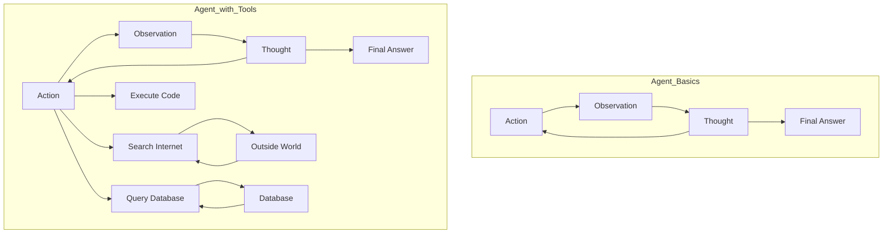

## 🧱 building stateful, multi-actor applications

- cycles
- controllability
- persistence

## 🤖 

## 📦

## 📚

### 🥃 Agents & Tools

### 🥃 Multi-Agent Workflows

### 🥃 

### 🥃 

### 🥃 

### 🥃 

### 🥃 

### 🥃 

### 🥃 

### 🥃 

### 🥃 

### 🥃 

### 🥃 

### 🥃 

### 🥃 

### 🥃 
