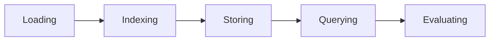
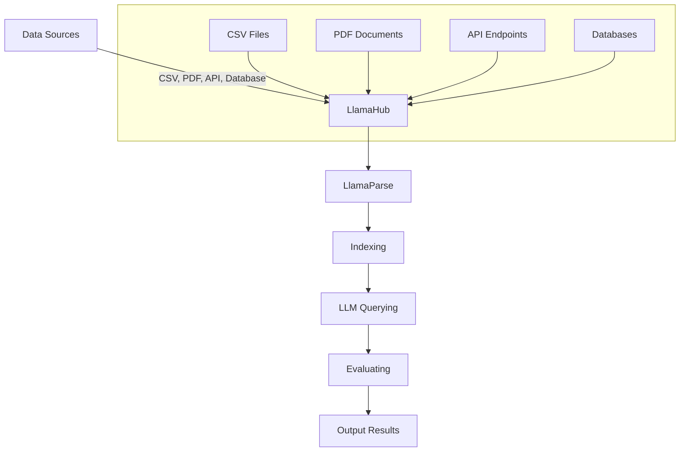

# LLamaIndex vs LangChain

- LLamaIndex-vs-LangChain-Basics

- Simple RAG System to compare LLamaIndex to LangChain

| **Step**                                 | **LangChain**                                                                                                         | **LlamaIndex**                                                                                                              |
|------------------------------------------|-----------------------------------------------------------------------------------------------------------------------|-----------------------------------------------------------------------------------------------------------------------------|
| **1. Import Required Libraries**         | `from langchain_community.document_loaders import DirectoryLoader`<br>`from dotenv import load_dotenv`                 | `from llama_index.core import VectorStoreIndex, SimpleDirectoryReader`<br>`from llama_index.llms.openai import OpenAI`<br>`from llama_index.core import Settings`<br>`from dotenv import load_dotenv` |
| **2. Load Environment Variables**        | `load_dotenv()`                                                                                                       | `load_dotenv()`                                                                                                             |
| **3. Load Documents**                    | `loader = DirectoryLoader('data', glob="**/*.txt")`<br>`documents = loader.load()`                                     | `documents = SimpleDirectoryReader("data").load_data()`                                                                     |
| **4. Display Loaded Documents**          | `print(documents)`<br>`print(documents[0].page_content)`                                                              | `print(documents)`<br>`print(documents[0].text)`                                                                            |
| **5. Initialize Text Splitter**          | `from langchain.text_splitter import CharacterTextSplitter`<br>`text_splitter = CharacterTextSplitter(...)`           | `from llama_index.core.node_parser import SentenceSplitter`<br>`text_splitter = SentenceSplitter(...)`                      |
| **6. Split Documents into Chunks**       | `chunks = text_splitter.split_documents(documents)`                                                                   | `nodes = text_splitter.get_nodes_from_documents(documents=documents)`                                                       |
| **7. Initialize Embeddings**             | `from langchain_openai import OpenAIEmbeddings`                                                                       | `from llama_index.embeddings.openai import OpenAIEmbedding`                                                                 |
| **8. Initialize Vector Store**           | `from langchain_community.vectorstores import Chroma`<br>`index = Chroma.from_documents(chunks, OpenAIEmbeddings())`  | `from llama_index.vector_stores.chroma import ChromaVectorStore`<br>`chroma_client = chromadb.EphemeralClient()`<br>`chroma_collection = chroma_client.create_collection("tes1233t")`<br>`vector_store = ChromaVectorStore(chroma_collection=chroma_collection)`<br>`storage_context = StorageContext.from_defaults(vector_store=vector_store)`<br>`index = VectorStoreIndex.from_documents(documents, storage_context=storage_context, embed_model=OpenAIEmbedding())` |
| **9. Retrieve Relevant Documents**       | `retriever = index.as_retriever()`<br>`retriever.get_relevant_documents("How long does it take to prepare a pizza")`  | `retriever = index.as_retriever()`<br>`retriever.retrieve("How long does it take to prepare a pizza")`                                                           |
| **10. Create Prompt Template**           | `template = """\nAnswer the question based only on the following context:\n{context}\n\nAnswer the following question:\nQuestion: {question}\n"""` | `new_summary_tmpl_str = (\n"You always say 'Hello my friend' at the beginning of your answer. Below you find data from a database\\n"\n"{context_str}\\n"\n"Take that context and try to answer the question with it."\n"Query: {query_str}\\n"Answer: "\n)`<br>`new_summary_tmpl = PromptTemplate(new_summary_tmpl_str)` |
| **11. Initialize LLM Model**             | `from langchain_openai import ChatOpenAI`<br>`model = ChatOpenAI(model_name="gpt-3.5-turbo")`                         | `Settings.llm = OpenAI(model="gpt-3.5-turbo")`<br>`query_engine = index.as_query_engine(llm=Settings.llm)`                                                      |
| **12. Combine Components into RAG Chain**| `rag_chain = (\n{\n"context": itemgetter("question") | retriever,\n"question": itemgetter("question")\n}\n| prompt\n| model\n| StrOutputParser()\n)`  | Not explicitly combined in this format, but similar steps are performed using `query_engine` and updated prompts.                                               |
| **13. Execute Query**                    | `rag_chain.invoke({"question": "How long does it take to prepare a pizza"})`                                          | `query_engine.query("How long does it take to prepare a pizza")`                                                                 |
| **14. Update Prompt Templates**          | Not shown in LangChain                                                                                                 | `query_engine.update_prompts(\n{"response_synthesizer:text_qa_template": new_summary_tmpl})`                                                                      |
| **15. Display Updated Prompts**          | Not shown in LangChain                                                                                                 | `prompts_dict = query_engine.get_prompts()`<br>`print(prompts_dict)`                                                                                              |
| **16. Re-execute Query with Updated Prompts** | Not shown in LangChain                                                                                                 | `query_engine.query("How long does it take to prepare a pizza")`                                                                 |


## 📖 5 steps

```python
from llama_index.core import VectorStoreIndex, SimpleDirectoryReader
from llama_parse import LlamaParse

documents = SimpleDirectoryReader("data").load_data()
# documents = LlamaParse(result_type="text").load_data("./your-file.whatever")
index = VectorStoreIndex.from_documents(documents)
query_engine = index.as_query_engine()
response = query_engine.query("What is the first article?")
print(response)
```


## 📖 LlamaIndex




1. Loading Stage: PDF, API, DB, node(metadata)==chink, Connectors (Reader)
2. Indexing Stage: vector embeddings, vector store, Embeddings,
3. Querying Stae: retrievers, Routers, Node Postprocessors, Response Synthesizers (合成器)
4.




## 📖 Integration, UI

### llama-index and web-UI integration

- EF: `React.js`  **React, Redux, Material-UI, D3.js, Axios**
- BE: **Node.js, Express, Redis, JWT, MongoDB/PostgreSQL**
    * API: RESTful APIs or GraphQL
    * Middleware layer: `Node.js/Express` handle Requests from UI, and process with LlamaIndex, as well as handing authentication, caching, and logging.
- Data Visualization: Chart.js, Graphs, Tables, Material-UI
- UI Chat/search: search and filtering, pagination
- Authentication and Authorization: JWT, SSO
- Performance: Caching, Lazy Loading
- Error Handling and Logging
- Test: **Jest, Cypress, Mocha/Chai**
- Deployment CI/CD: **GitHub Actions, Docker, Kubernets, Jenkins, GitLab CI**
- Integration: WebSockets, CronJob


### RDBMS (PostgreSQL) integrate with LlamaIndex

- Set Up the LlamaIndex Environment: llama-index, llama-index-vector-stores-postgres psycopg2-binary
- Extract Data from PostgreSQL
- Prepare Data for Indexing
- Index the Data Using LlamaIndex

```python
from llama_index import SimpleDirectoryReader, GPTVectorStoreIndex, LLMPredictor, PromptHelper
from llama_index.node_parser import SimpleNodeParser
from llama_index.vector_stores import GPTVectorStore

# Assume texts is a list of documents/text to be indexed
documents = [SimpleDirectoryReader(doc).load() for doc in texts]

# Create LlamaIndex
index = GPTVectorStoreIndex.from_documents(documents)
```

- Sync with Vector Storage (use external vector storage like Faiss, Pinecone)

```python
from llama_index.vector_stores.faiss import FaissVectorStore

vector_store = FaissVectorStore.from_index(index)
vector_store.add(documents)
vector_store.save("faiss_index")
```

- Querying and Summarization
- Automation and Sync
  * Set up a cron job or a background service to periodically sync new data from your PostgreSQL database to the LlamaIndex vector storage.
  * Ensure that the sync process is efficient, only reindexing or updating vectors for modified or new records.
- Deployment and Scaling
  * Deploy your setup in a production environment using Docker, Kubernetes, or any other container orchestration system.
  * Consider scaling LlamaIndex and your vector store as needed to handle large datasets and high query volumes.


### MongoDB and LlamaIndex

LlamaIndex provides a MongoDB vector store integration that allows you to use MongoDB as the backend for storing and retrieving vector embeddings. This integration is particularly useful when you want to leverage MongoDB's scalability and flexibility for managing your vector data.
Here's a basic outline of how to integrate MongoDB with LlamaIndex:

- Install required packages
- Set up MongoDB connection
- Create a MongoDB vector store
- Use the vector store with LlamaIndex

