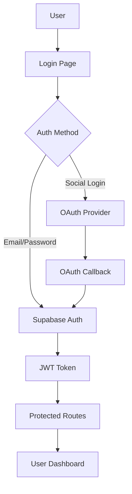

# Authentication & Social Media Account Integration

## Overview

Modern web applications require robust authentication systems that support multiple login methods. This guide covers implementing comprehensive authentication using Supabase Auth with social media providers, including security best practices and user experience optimization.

## Authentication Architecture

### Core Authentication Flow



## Supabase Auth Setup

### Environment Configuration

```bash
# .env.local
NEXT_PUBLIC_SUPABASE_URL=https://your-project.supabase.co
NEXT_PUBLIC_SUPABASE_ANON_KEY=your-anon-key
SUPABASE_SERVICE_ROLE_KEY=your-service-role-key

# Social Provider Secrets
GOOGLE_CLIENT_ID=your-google-client-id
GOOGLE_CLIENT_SECRET=your-google-client-secret
GITHUB_CLIENT_ID=your-github-client-id
GITHUB_CLIENT_SECRET=your-github-client-secret
FACEBOOK_CLIENT_ID=your-facebook-client-id
FACEBOOK_CLIENT_SECRET=your-facebook-client-secret
TWITTER_CLIENT_ID=your-twitter-client-id
TWITTER_CLIENT_SECRET=your-twitter-client-secret
DISCORD_CLIENT_ID=your-discord-client-id
DISCORD_CLIENT_SECRET=your-discord-client-secret
```

### Supabase Client Configuration

```tsx
// lib/supabase/client.ts
import { createClientComponentClient } from '@supabase/auth-helpers-nextjs'
import { createServerComponentClient } from '@supabase/auth-helpers-nextjs'
import { createRouteHandlerClient } from '@supabase/auth-helpers-nextjs'
import { cookies } from 'next/headers'

// Client-side Supabase client
export const createClientSupabaseClient = () => 
  createClientComponentClient()

// Server Component client
export const createServerSupabaseClient = () => 
  createServerComponentClient({ cookies })

// Route Handler client
export const createRouteHandlerSupabaseClient = () => 
  createRouteHandlerClient({ cookies })

// Types
export type Database = {
  public: {
    Tables: {
      profiles: {
        Row: {
          id: string
          created_at: string
          updated_at: string
          email: string
          full_name: string | null
          avatar_url: string | null
          username: string | null
          website: string | null
          bio: string | null
          location: string | null
          birth_date: string | null
          phone: string | null
          is_verified: boolean
          role: 'user' | 'admin' | 'moderator'
          preferences: Json
          social_links: Json
          last_seen: string | null
        }
        Insert: {
          id: string
          email: string
          full_name?: string | null
          avatar_url?: string | null
          username?: string | null
          website?: string | null
          bio?: string | null
          location?: string | null
          birth_date?: string | null
          phone?: string | null
          preferences?: Json
          social_links?: Json
        }
        Update: {
          full_name?: string | null
          avatar_url?: string | null
          username?: string | null
          website?: string | null
          bio?: string | null
          location?: string | null
          birth_date?: string | null
          phone?: string | null
          preferences?: Json
          social_links?: Json
          last_seen?: string | null
        }
      }
    }
  }
}
```

## Social Media Authentication

### Google OAuth Setup

```tsx
// components/auth/GoogleSignIn.tsx
'use client'
import { createClientSupabaseClient } from '@/lib/supabase/client'
import { Button } from '@/components/ui/Button'

export function GoogleSignIn() {
  const supabase = createClientSupabaseClient()

  const handleGoogleSignIn = async () => {
    try {
      const { data, error } = await supabase.auth.signInWithOAuth({
        provider: 'google',
        options: {
          redirectTo: `${window.location.origin}/auth/callback`,
          queryParams: {
            access_type: 'offline',
            prompt: 'consent',
          },
          scopes: 'email profile'
        }
      })

      if (error) {
        console.error('Google sign-in error:', error.message)
        throw error
      }
    } catch (error) {
      console.error('Authentication failed:', error)
    }
  }

  return (
    <Button
      onClick={handleGoogleSignIn}
      variant="outline"
      className="w-full flex items-center gap-2"
    >
      <svg className="w-5 h-5" viewBox="0 0 24 24">
        <path fill="currentColor" d="M22.56 12.25c0-.78-.07-1.53-.2-2.25H12v4.26h5.92c-.26 1.37-1.04 2.53-2.21 3.31v2.77h3.57c2.08-1.92 3.28-4.74 3.28-8.09z"/>
        <path fill="currentColor" d="M12 23c2.97 0 5.46-.98 7.28-2.66l-3.57-2.77c-.98.66-2.23 1.06-3.71 1.06-2.86 0-5.29-1.93-6.16-4.53H2.18v2.84C3.99 20.53 7.7 23 12 23z"/>
        <path fill="currentColor" d="M5.84 14.09c-.22-.66-.35-1.36-.35-2.09s.13-1.43.35-2.09V7.07H2.18C1.43 8.55 1 10.22 1 12s.43 3.45 1.18 4.93l2.85-2.22.81-.62z"/>
        <path fill="currentColor" d="M12 5.38c1.62 0 3.06.56 4.21 1.64l3.15-3.15C17.45 2.09 14.97 1 12 1 7.7 1 3.99 3.47 2.18 7.07l3.66 2.84c.87-2.6 3.3-4.53 6.16-4.53z"/>
      </svg>
      Continue with Google
    </Button>
  )
}
```

### GitHub OAuth Setup

```tsx
// components/auth/GitHubSignIn.tsx
'use client'
import { createClientSupabaseClient } from '@/lib/supabase/client'
import { Button } from '@/components/ui/Button'

export function GitHubSignIn() {
  const supabase = createClientSupabaseClient()

  const handleGitHubSignIn = async () => {
    try {
      const { data, error } = await supabase.auth.signInWithOAuth({
        provider: 'github',
        options: {
          redirectTo: `${window.location.origin}/auth/callback`,
          scopes: 'read:user user:email'
        }
      })

      if (error) throw error
    } catch (error) {
      console.error('GitHub authentication failed:', error)
    }
  }

  return (
    <Button
      onClick={handleGitHubSignIn}
      variant="outline"
      className="w-full flex items-center gap-2"
    >
      <svg className="w-5 h-5" fill="currentColor" viewBox="0 0 24 24">
        <path d="M12 0C5.374 0 0 5.373 0 12 0 17.302 3.438 21.8 8.207 23.387c.599.111.793-.261.793-.577v-2.234c-3.338.726-4.033-1.416-4.033-1.416-.546-1.387-1.333-1.756-1.333-1.756-1.089-.745.083-.729.083-.729 1.205.084 1.839 1.237 1.839 1.237 1.07 1.834 2.807 1.304 3.492.997.107-.775.418-1.305.762-1.604-2.665-.305-5.467-1.334-5.467-5.931 0-1.311.469-2.381 1.236-3.221-.124-.303-.535-1.524.117-3.176 0 0 1.008-.322 3.301 1.23A11.509 11.509 0 0112 5.803c1.02.005 2.047.138 3.006.404 2.291-1.552 3.297-1.23 3.297-1.23.653 1.653.242 2.874.118 3.176.77.84 1.235 1.911 1.235 3.221 0 4.609-2.807 5.624-5.479 5.921.43.372.823 1.102.823 2.222v3.293c0 .319.192.694.801.576C20.566 21.797 24 17.3 24 12c0-6.627-5.373-12-12-12z"/>
      </svg>
      Continue with GitHub
    </Button>
  )
}
```

### Multi-Provider Auth Component

```tsx
// components/auth/SocialAuth.tsx
'use client'
import { useState } from 'react'
import { GoogleSignIn } from './GoogleSignIn'
import { GitHubSignIn } from './GitHubSignIn'
import { FacebookSignIn } from './FacebookSignIn'
import { TwitterSignIn } from './TwitterSignIn'
import { DiscordSignIn } from './DiscordSignIn'

interface SocialAuthProps {
  providers?: ('google' | 'github' | 'facebook' | 'twitter' | 'discord')[]
  redirectTo?: string
}

export function SocialAuth({ 
  providers = ['google', 'github'], 
  redirectTo = '/dashboard' 
}: SocialAuthProps) {
  const [loading, setLoading] = useState<string | null>(null)

  const providerComponents = {
    google: GoogleSignIn,
    github: GitHubSignIn,
    facebook: FacebookSignIn,
    twitter: TwitterSignIn,
    discord: DiscordSignIn,
  }

  return (
    <div className="space-y-3">
      <div className="relative">
        <div className="absolute inset-0 flex items-center">
          <span className="w-full border-t border-gray-300" />
        </div>
        <div className="relative flex justify-center text-sm">
          <span className="px-2 bg-white text-gray-500">Or continue with</span>
        </div>
      </div>

      <div className="grid grid-cols-1 gap-3">
        {providers.map((provider) => {
          const ProviderComponent = providerComponents[provider]
          return (
            <ProviderComponent
              key={provider}
              loading={loading === provider}
              onLoadingChange={setLoading}
              redirectTo={redirectTo}
            />
          )
        })}
      </div>
    </div>
  )
}
```

## Email/Password Authentication

### Sign Up Component

```tsx
// components/auth/SignUpForm.tsx
'use client'
import { useState } from 'react'
import { createClientSupabaseClient } from '@/lib/supabase/client'
import { Button } from '@/components/ui/Button'
import { Input } from '@/components/ui/Input'
import { useRouter } from 'next/navigation'

export function SignUpForm() {
  const [formData, setFormData] = useState({
    email: '',
    password: '',
    confirmPassword: '',
    fullName: '',
  })
  const [loading, setLoading] = useState(false)
  const [errors, setErrors] = useState<Record<string, string>>({})
  
  const supabase = createClientSupabaseClient()
  const router = useRouter()

  const validateForm = () => {
    const newErrors: Record<string, string> = {}

    if (!formData.email) {
      newErrors.email = 'Email is required'
    } else if (!/\S+@\S+\.\S+/.test(formData.email)) {
      newErrors.email = 'Email is invalid'
    }

    if (!formData.password) {
      newErrors.password = 'Password is required'
    } else if (formData.password.length < 8) {
      newErrors.password = 'Password must be at least 8 characters'
    }

    if (formData.password !== formData.confirmPassword) {
      newErrors.confirmPassword = 'Passwords do not match'
    }

    if (!formData.fullName) {
      newErrors.fullName = 'Full name is required'
    }

    setErrors(newErrors)
    return Object.keys(newErrors).length === 0
  }

  const handleSubmit = async (e: React.FormEvent) => {
    e.preventDefault()
    
    if (!validateForm()) return

    setLoading(true)
    setErrors({})

    try {
      const { data, error } = await supabase.auth.signUp({
        email: formData.email,
        password: formData.password,
        options: {
          data: {
            full_name: formData.fullName,
          },
          emailRedirectTo: `${window.location.origin}/auth/callback`
        }
      })

      if (error) throw error

      if (data.user && !data.user.email_confirmed_at) {
        router.push('/auth/check-email')
      } else {
        router.push('/dashboard')
      }
    } catch (error: any) {
      setErrors({ submit: error.message })
    } finally {
      setLoading(false)
    }
  }

  return (
    <form onSubmit={handleSubmit} className="space-y-4">
      <Input
        label="Full Name"
        type="text"
        value={formData.fullName}
        onChange={(e) => setFormData({ ...formData, fullName: e.target.value })}
        error={errors.fullName}
        required
      />

      <Input
        label="Email"
        type="email"
        value={formData.email}
        onChange={(e) => setFormData({ ...formData, email: e.target.value })}
        error={errors.email}
        required
      />

      <Input
        label="Password"
        type="password"
        value={formData.password}
        onChange={(e) => setFormData({ ...formData, password: e.target.value })}
        error={errors.password}
        hint="Must be at least 8 characters"
        required
      />

      <Input
        label="Confirm Password"
        type="password"
        value={formData.confirmPassword}
        onChange={(e) => setFormData({ ...formData, confirmPassword: e.target.value })}
        error={errors.confirmPassword}
        required
      />

      {errors.submit && (
        <div className="text-red-600 text-sm">{errors.submit}</div>
      )}

      <Button
        type="submit"
        className="w-full"
        loading={loading}
        disabled={loading}
      >
        Create Account
      </Button>
    </form>
  )
}
```

### Sign In Component

```tsx
// components/auth/SignInForm.tsx
'use client'
import { useState } from 'react'
import { createClientSupabaseClient } from '@/lib/supabase/client'
import { Button } from '@/components/ui/Button'
import { Input } from '@/components/ui/Input'
import { useRouter } from 'next/navigation'
import Link from 'next/link'

export function SignInForm() {
  const [formData, setFormData] = useState({
    email: '',
    password: '',
  })
  const [loading, setLoading] = useState(false)
  const [error, setError] = useState('')
  
  const supabase = createClientSupabaseClient()
  const router = useRouter()

  const handleSubmit = async (e: React.FormEvent) => {
    e.preventDefault()
    setLoading(true)
    setError('')

    try {
      const { data, error } = await supabase.auth.signInWithPassword({
        email: formData.email,
        password: formData.password,
      })

      if (error) throw error

      router.push('/dashboard')
      router.refresh()
    } catch (error: any) {
      setError(error.message)
    } finally {
      setLoading(false)
    }
  }

  return (
    <form onSubmit={handleSubmit} className="space-y-4">
      <Input
        label="Email"
        type="email"
        value={formData.email}
        onChange={(e) => setFormData({ ...formData, email: e.target.value })}
        required
      />

      <Input
        label="Password"
        type="password"
        value={formData.password}
        onChange={(e) => setFormData({ ...formData, password: e.target.value })}
        required
      />

      <div className="flex items-center justify-between">
        <label className="flex items-center">
          <input type="checkbox" className="mr-2" />
          <span className="text-sm text-gray-600">Remember me</span>
        </label>
        
        <Link 
          href="/auth/reset-password" 
          className="text-sm text-primary-600 hover:underline"
        >
          Forgot password?
        </Link>
      </div>

      {error && (
        <div className="text-red-600 text-sm">{error}</div>
      )}

      <Button
        type="submit"
        className="w-full"
        loading={loading}
        disabled={loading}
      >
        Sign In
      </Button>
    </form>
  )
}
```

## Authentication Context & Hooks

### Auth Context Provider

```tsx
// context/AuthContext.tsx
'use client'
import { createContext, useContext, useEffect, useState } from 'react'
import { User, Session } from '@supabase/supabase-js'
import { createClientSupabaseClient } from '@/lib/supabase/client'
import { Database } from '@/lib/supabase/types'

type Profile = Database['public']['Tables']['profiles']['Row']

interface AuthContextType {
  user: User | null
  profile: Profile | null
  session: Session | null
  loading: boolean
  signOut: () => Promise<void>
  refreshProfile: () => Promise<void>
}

const AuthContext = createContext<AuthContextType | undefined>(undefined)

export function AuthProvider({ children }: { children: React.ReactNode }) {
  const [user, setUser] = useState<User | null>(null)
  const [profile, setProfile] = useState<Profile | null>(null)
  const [session, setSession] = useState<Session | null>(null)
  const [loading, setLoading] = useState(true)

  const supabase = createClientSupabaseClient()

  const fetchProfile = async (userId: string) => {
    try {
      const { data, error } = await supabase
        .from('profiles')
        .select('*')
        .eq('id', userId)
        .single()

      if (error && error.code !== 'PGRST116') {
        console.error('Error fetching profile:', error)
        return null
      }

      return data
    } catch (error) {
      console.error('Error fetching profile:', error)
      return null
    }
  }

  const refreshProfile = async () => {
    if (user) {
      const profileData = await fetchProfile(user.id)
      setProfile(profileData)
    }
  }

  const signOut = async () => {
    await supabase.auth.signOut()
  }

  useEffect(() => {
    const getSession = async () => {
      const { data: { session } } = await supabase.auth.getSession()
      setSession(session)
      setUser(session?.user ?? null)

      if (session?.user) {
        const profileData = await fetchProfile(session.user.id)
        setProfile(profileData)
      }

      setLoading(false)
    }

    getSession()

    const { data: { subscription } } = supabase.auth.onAuthStateChange(
      async (event, session) => {
        setSession(session)
        setUser(session?.user ?? null)

        if (session?.user) {
          const profileData = await fetchProfile(session.user.id)
          setProfile(profileData)
        } else {
          setProfile(null)
        }

        setLoading(false)
      }
    )

    return () => subscription.unsubscribe()
  }, [])

  return (
    <AuthContext.Provider value={{
      user,
      profile,
      session,
      loading,
      signOut,
      refreshProfile,
    }}>
      {children}
    </AuthContext.Provider>
  )
}

export function useAuth() {
  const context = useContext(AuthContext)
  if (context === undefined) {
    throw new Error('useAuth must be used within an AuthProvider')
  }
  return context
}
```

## Authentication Middleware

### Route Protection

```tsx
// middleware.ts
import { createMiddlewareClient } from '@supabase/auth-helpers-nextjs'
import { NextResponse } from 'next/server'
import type { NextRequest } from 'next/server'

export async function middleware(req: NextRequest) {
  const res = NextResponse.next()
  const supabase = createMiddlewareClient({ req, res })
  
  const {
    data: { session },
  } = await supabase.auth.getSession()

  // Protected routes
  const protectedRoutes = ['/dashboard', '/profile', '/settings', '/admin']
  const authRoutes = ['/auth/signin', '/auth/signup']
  
  const isProtectedRoute = protectedRoutes.some(route => 
    req.nextUrl.pathname.startsWith(route)
  )
  const isAuthRoute = authRoutes.some(route => 
    req.nextUrl.pathname.startsWith(route)
  )

  // Redirect unauthenticated users from protected routes
  if (isProtectedRoute && !session) {
    const redirectUrl = new URL('/auth/signin', req.url)
    redirectUrl.searchParams.set('redirectTo', req.nextUrl.pathname)
    return NextResponse.redirect(redirectUrl)
  }

  // Redirect authenticated users from auth routes
  if (isAuthRoute && session) {
    const redirectTo = req.nextUrl.searchParams.get('redirectTo') || '/dashboard'
    return NextResponse.redirect(new URL(redirectTo, req.url))
  }

  return res
}

export const config = {
  matcher: [
    '/((?!_next/static|_next/image|favicon.ico|public).*)',
  ],
}
```

## Profile Management

### Profile Page Component

```tsx
// app/profile/page.tsx
import { createServerSupabaseClient } from '@/lib/supabase/client'
import { ProfileForm } from '@/components/profile/ProfileForm'
import { redirect } from 'next/navigation'

export default async function ProfilePage() {
  const supabase = createServerSupabaseClient()
  
  const {
    data: { session },
  } = await supabase.auth.getSession()

  if (!session) {
    redirect('/auth/signin')
  }

  const { data: profile } = await supabase
    .from('profiles')
    .select('*')
    .eq('id', session.user.id)
    .single()

  return (
    <div className="max-w-2xl mx-auto p-6">
      <h1 className="text-2xl font-bold mb-6">Profile Settings</h1>
      <ProfileForm profile={profile} user={session.user} />
    </div>
  )
}
```

### Editable Profile Form

```tsx
// components/profile/ProfileForm.tsx
'use client'
import { useState } from 'react'
import { User } from '@supabase/supabase-js'
import { createClientSupabaseClient } from '@/lib/supabase/client'
import { Button } from '@/components/ui/Button'
import { Input } from '@/components/ui/Input'
import { AvatarUpload } from './AvatarUpload'
import { useAuth } from '@/context/AuthContext'

interface ProfileFormProps {
  profile: any
  user: User
}

export function ProfileForm({ profile, user }: ProfileFormProps) {
  const [formData, setFormData] = useState({
    full_name: profile?.full_name || '',
    username: profile?.username || '',
    website: profile?.website || '',
    bio: profile?.bio || '',
    location: profile?.location || '',
    avatar_url: profile?.avatar_url || '',
  })
  const [loading, setLoading] = useState(false)
  const [message, setMessage] = useState('')
  
  const supabase = createClientSupabaseClient()
  const { refreshProfile } = useAuth()

  const handleSubmit = async (e: React.FormEvent) => {
    e.preventDefault()
    setLoading(true)
    setMessage('')

    try {
      const { error } = await supabase
        .from('profiles')
        .upsert({
          id: user.id,
          email: user.email!,
          ...formData,
          updated_at: new Date().toISOString(),
        })

      if (error) throw error

      await refreshProfile()
      setMessage('Profile updated successfully!')
    } catch (error: any) {
      setMessage('Error updating profile: ' + error.message)
    } finally {
      setLoading(false)
    }
  }

  const handleAvatarUpload = (url: string) => {
    setFormData({ ...formData, avatar_url: url })
  }

  return (
    <form onSubmit={handleSubmit} className="space-y-6">
      <AvatarUpload
        uid={user.id}
        url={formData.avatar_url}
        onUpload={handleAvatarUpload}
      />

      <Input
        label="Full Name"
        value={formData.full_name}
        onChange={(e) => setFormData({ ...formData, full_name: e.target.value })}
      />

      <Input
        label="Username"
        value={formData.username}
        onChange={(e) => setFormData({ ...formData, username: e.target.value })}
      />

      <Input
        label="Website"
        type="url"
        value={formData.website}
        onChange={(e) => setFormData({ ...formData, website: e.target.value })}
      />

      <div>
        <label className="block text-sm font-medium text-gray-700 mb-1">
          Bio
        </label>
        <textarea
          rows={4}
          value={formData.bio}
          onChange={(e) => setFormData({ ...formData, bio: e.target.value })}
          className="block w-full px-3 py-2 border border-gray-300 rounded-md shadow-sm focus:outline-none focus:ring-primary-500 focus:border-primary-500"
          placeholder="Tell us about yourself..."
        />
      </div>

      <Input
        label="Location"
        value={formData.location}
        onChange={(e) => setFormData({ ...formData, location: e.target.value })}
      />

      {message && (
        <div className={`text-sm ${message.includes('Error') ? 'text-red-600' : 'text-green-600'}`}>
          {message}
        </div>
      )}

      <Button
        type="submit"
        loading={loading}
        disabled={loading}
      >
        Update Profile
      </Button>
    </form>
  )
}
```

## Security Best Practices

### Row Level Security (RLS)

```sql
-- Enable RLS on profiles table
ALTER TABLE profiles ENABLE ROW LEVEL SECURITY;

-- Users can view their own profile
CREATE POLICY "Users can view own profile"
ON profiles FOR SELECT
USING (auth.uid() = id);

-- Users can update their own profile
CREATE POLICY "Users can update own profile"
ON profiles FOR UPDATE
USING (auth.uid() = id);

-- Users can insert their own profile
CREATE POLICY "Users can insert own profile"
ON profiles FOR INSERT
WITH CHECK (auth.uid() = id);

-- Public profiles are viewable by everyone
CREATE POLICY "Public profiles are viewable by everyone"
ON profiles FOR SELECT
USING (true);
```

### Database Triggers

```sql
-- Auto-create profile on user signup
CREATE OR REPLACE FUNCTION public.handle_new_user()
RETURNS trigger AS $$
BEGIN
  INSERT INTO public.profiles (id, email, full_name, avatar_url)
  VALUES (
    new.id,
    new.email,
    new.raw_user_meta_data->>'full_name',
    new.raw_user_meta_data->>'avatar_url'
  );
  RETURN new;
END;
$$ LANGUAGE plpgsql SECURITY DEFINER;

-- Trigger the function every time a user is created
CREATE TRIGGER on_auth_user_created
  AFTER INSERT ON auth.users
  FOR EACH ROW EXECUTE PROCEDURE public.handle_new_user();
```

This comprehensive authentication system provides a robust foundation for user management, social login integration, and secure profile handling in your Next.js application with Supabase.
