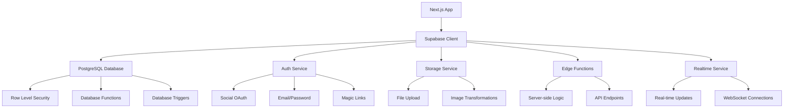

# Supabase: Complete Backend-as-a-Service Integration

## Overview

Supabase is an open-source Backend-as-a-Service (BaaS) that provides a complete backend infrastructure including PostgreSQL database, authentication, real-time subscriptions, edge functions, and file storage. This guide covers comprehensive integration with Next.js applications.

## Core Architecture



## Database Design & Management

### Database Schema Design

```sql
-- Enable necessary extensions
CREATE EXTENSION IF NOT EXISTS "uuid-ossp";
CREATE EXTENSION IF NOT EXISTS "pgcrypto";

-- Users profiles table
CREATE TABLE profiles (
  id UUID REFERENCES auth.users PRIMARY KEY,
  created_at TIMESTAMP WITH TIME ZONE DEFAULT NOW(),
  updated_at TIMESTAMP WITH TIME ZONE DEFAULT NOW(),
  email TEXT UNIQUE NOT NULL,
  full_name TEXT,
  avatar_url TEXT,
  username TEXT UNIQUE,
  website TEXT,
  bio TEXT,
  location TEXT,
  birth_date DATE,
  phone TEXT,
  is_verified BOOLEAN DEFAULT FALSE,
  role TEXT DEFAULT 'user' CHECK (role IN ('user', 'admin', 'moderator')),
  preferences JSONB DEFAULT '{}',
  social_links JSONB DEFAULT '{}',
  last_seen TIMESTAMP WITH TIME ZONE DEFAULT NOW()
);

-- Products table for e-commerce functionality
CREATE TABLE products (
  id UUID DEFAULT uuid_generate_v4() PRIMARY KEY,
  created_at TIMESTAMP WITH TIME ZONE DEFAULT NOW(),
  updated_at TIMESTAMP WITH TIME ZONE DEFAULT NOW(),
  name TEXT NOT NULL,
  description TEXT,
  price DECIMAL(10,2) NOT NULL,
  currency TEXT DEFAULT 'USD',
  category_id UUID REFERENCES categories(id),
  inventory_count INTEGER DEFAULT 0,
  is_active BOOLEAN DEFAULT TRUE,
  images JSONB DEFAULT '[]',
  metadata JSONB DEFAULT '{}',
  stripe_product_id TEXT,
  stripe_price_id TEXT
);

-- Categories table
CREATE TABLE categories (
  id UUID DEFAULT uuid_generate_v4() PRIMARY KEY,
  created_at TIMESTAMP WITH TIME ZONE DEFAULT NOW(),
  name TEXT NOT NULL,
  slug TEXT UNIQUE NOT NULL,
  description TEXT,
  parent_id UUID REFERENCES categories(id),
  is_active BOOLEAN DEFAULT TRUE
);

-- Orders table
CREATE TABLE orders (
  id UUID DEFAULT uuid_generate_v4() PRIMARY KEY,
  created_at TIMESTAMP WITH TIME ZONE DEFAULT NOW(),
  updated_at TIMESTAMP WITH TIME ZONE DEFAULT NOW(),
  user_id UUID REFERENCES auth.users NOT NULL,
  status TEXT DEFAULT 'pending' CHECK (status IN ('pending', 'processing', 'shipped', 'delivered', 'cancelled')),
  total_amount DECIMAL(10,2) NOT NULL,
  currency TEXT DEFAULT 'USD',
  stripe_payment_intent_id TEXT,
  shipping_address JSONB,
  billing_address JSONB,
  notes TEXT
);

-- Order items table
CREATE TABLE order_items (
  id UUID DEFAULT uuid_generate_v4() PRIMARY KEY,
  order_id UUID REFERENCES orders(id) ON DELETE CASCADE,
  product_id UUID REFERENCES products(id),
  quantity INTEGER NOT NULL DEFAULT 1,
  unit_price DECIMAL(10,2) NOT NULL,
  total_price DECIMAL(10,2) NOT NULL
);

-- Reviews table
CREATE TABLE reviews (
  id UUID DEFAULT uuid_generate_v4() PRIMARY KEY,
  created_at TIMESTAMP WITH TIME ZONE DEFAULT NOW(),
  updated_at TIMESTAMP WITH TIME ZONE DEFAULT NOW(),
  user_id UUID REFERENCES auth.users NOT NULL,
  product_id UUID REFERENCES products(id) ON DELETE CASCADE,
  rating INTEGER NOT NULL CHECK (rating >= 1 AND rating <= 5),
  title TEXT,
  content TEXT,
  is_verified BOOLEAN DEFAULT FALSE
);

-- Wishlist table
CREATE TABLE wishlist (
  id UUID DEFAULT uuid_generate_v4() PRIMARY KEY,
  created_at TIMESTAMP WITH TIME ZONE DEFAULT NOW(),
  user_id UUID REFERENCES auth.users NOT NULL,
  product_id UUID REFERENCES products(id) ON DELETE CASCADE,
  UNIQUE(user_id, product_id)
);

-- Shopping cart table
CREATE TABLE cart_items (
  id UUID DEFAULT uuid_generate_v4() PRIMARY KEY,
  created_at TIMESTAMP WITH TIME ZONE DEFAULT NOW(),
  updated_at TIMESTAMP WITH TIME ZONE DEFAULT NOW(),
  user_id UUID REFERENCES auth.users NOT NULL,
  product_id UUID REFERENCES products(id) ON DELETE CASCADE,
  quantity INTEGER NOT NULL DEFAULT 1,
  UNIQUE(user_id, product_id)
);
```

### Row Level Security (RLS) Policies

```sql
-- Enable RLS on all tables
ALTER TABLE profiles ENABLE ROW LEVEL SECURITY;
ALTER TABLE products ENABLE ROW LEVEL SECURITY;
ALTER TABLE orders ENABLE ROW LEVEL SECURITY;
ALTER TABLE order_items ENABLE ROW LEVEL SECURITY;
ALTER TABLE reviews ENABLE ROW LEVEL SECURITY;
ALTER TABLE wishlist ENABLE ROW LEVEL SECURITY;
ALTER TABLE cart_items ENABLE ROW LEVEL SECURITY;

-- Profiles policies
CREATE POLICY "Users can view own profile" ON profiles
  FOR SELECT USING (auth.uid() = id);

CREATE POLICY "Users can update own profile" ON profiles
  FOR UPDATE USING (auth.uid() = id);

CREATE POLICY "Users can insert own profile" ON profiles
  FOR INSERT WITH CHECK (auth.uid() = id);

-- Products policies (public read, admin write)
CREATE POLICY "Anyone can view active products" ON products
  FOR SELECT USING (is_active = true);

CREATE POLICY "Admins can manage products" ON products
  FOR ALL USING (
    EXISTS (
      SELECT 1 FROM profiles 
      WHERE id = auth.uid() AND role = 'admin'
    )
  );

-- Orders policies
CREATE POLICY "Users can view own orders" ON orders
  FOR SELECT USING (auth.uid() = user_id);

CREATE POLICY "Users can create own orders" ON orders
  FOR INSERT WITH CHECK (auth.uid() = user_id);

CREATE POLICY "Admins can view all orders" ON orders
  FOR SELECT USING (
    EXISTS (
      SELECT 1 FROM profiles 
      WHERE id = auth.uid() AND role IN ('admin', 'moderator')
    )
  );

-- Order items policies
CREATE POLICY "Users can view own order items" ON order_items
  FOR SELECT USING (
    EXISTS (
      SELECT 1 FROM orders 
      WHERE id = order_id AND user_id = auth.uid()
    )
  );

-- Reviews policies
CREATE POLICY "Anyone can view reviews" ON reviews
  FOR SELECT USING (true);

CREATE POLICY "Users can create reviews" ON reviews
  FOR INSERT WITH CHECK (auth.uid() = user_id);

CREATE POLICY "Users can update own reviews" ON reviews
  FOR UPDATE USING (auth.uid() = user_id);

-- Wishlist policies
CREATE POLICY "Users can manage own wishlist" ON wishlist
  FOR ALL USING (auth.uid() = user_id);

-- Cart policies
CREATE POLICY "Users can manage own cart" ON cart_items
  FOR ALL USING (auth.uid() = user_id);
```

### Database Functions

```sql
-- Function to get user cart with product details
CREATE OR REPLACE FUNCTION get_user_cart(user_uuid UUID)
RETURNS TABLE (
  cart_item_id UUID,
  product_id UUID,
  product_name TEXT,
  product_price DECIMAL,
  quantity INTEGER,
  total_price DECIMAL,
  product_images JSONB
) 
LANGUAGE plpgsql
SECURITY DEFINER
AS $$
BEGIN
  RETURN QUERY
  SELECT 
    ci.id,
    p.id,
    p.name,
    p.price,
    ci.quantity,
    (p.price * ci.quantity) AS total_price,
    p.images
  FROM cart_items ci
  JOIN products p ON ci.product_id = p.id
  WHERE ci.user_id = user_uuid AND p.is_active = true;
END;
$$;

-- Function to calculate order total
CREATE OR REPLACE FUNCTION calculate_order_total(order_uuid UUID)
RETURNS DECIMAL
LANGUAGE plpgsql
SECURITY DEFINER
AS $$
DECLARE
  total DECIMAL;
BEGIN
  SELECT SUM(total_price) INTO total
  FROM order_items
  WHERE order_id = order_uuid;
  
  RETURN COALESCE(total, 0);
END;
$$;

-- Function to check product inventory
CREATE OR REPLACE FUNCTION check_product_inventory(product_uuid UUID, requested_quantity INTEGER)
RETURNS BOOLEAN
LANGUAGE plpgsql
SECURITY DEFINER
AS $$
DECLARE
  available_count INTEGER;
BEGIN
  SELECT inventory_count INTO available_count
  FROM products
  WHERE id = product_uuid AND is_active = true;
  
  RETURN (available_count >= requested_quantity);
END;
$$;

-- Function to update product inventory
CREATE OR REPLACE FUNCTION update_product_inventory(product_uuid UUID, quantity_change INTEGER)
RETURNS BOOLEAN
LANGUAGE plpgsql
SECURITY DEFINER
AS $$
BEGIN
  UPDATE products
  SET inventory_count = inventory_count + quantity_change,
      updated_at = NOW()
  WHERE id = product_uuid;
  
  RETURN FOUND;
END;
$$;
```

### Database Triggers

```sql
-- Trigger to auto-update updated_at column
CREATE OR REPLACE FUNCTION update_updated_at_column()
RETURNS TRIGGER AS $$
BEGIN
  NEW.updated_at = NOW();
  RETURN NEW;
END;
$$ LANGUAGE plpgsql;

-- Apply to all tables with updated_at
CREATE TRIGGER update_profiles_updated_at BEFORE UPDATE ON profiles
  FOR EACH ROW EXECUTE PROCEDURE update_updated_at_column();

CREATE TRIGGER update_products_updated_at BEFORE UPDATE ON products
  FOR EACH ROW EXECUTE PROCEDURE update_updated_at_column();

CREATE TRIGGER update_orders_updated_at BEFORE UPDATE ON orders
  FOR EACH ROW EXECUTE PROCEDURE update_updated_at_column();

-- Trigger to create user profile on signup
CREATE OR REPLACE FUNCTION public.handle_new_user()
RETURNS TRIGGER AS $$
BEGIN
  INSERT INTO public.profiles (id, email, full_name, avatar_url)
  VALUES (
    NEW.id,
    NEW.email,
    NEW.raw_user_meta_data->>'full_name',
    NEW.raw_user_meta_data->>'avatar_url'
  );
  RETURN NEW;
END;
$$ LANGUAGE plpgsql SECURITY DEFINER;

CREATE TRIGGER on_auth_user_created
  AFTER INSERT ON auth.users
  FOR EACH ROW EXECUTE PROCEDURE public.handle_new_user();

-- Trigger to update order total when order items change
CREATE OR REPLACE FUNCTION update_order_total()
RETURNS TRIGGER AS $$
BEGIN
  UPDATE orders
  SET total_amount = calculate_order_total(COALESCE(NEW.order_id, OLD.order_id)),
      updated_at = NOW()
  WHERE id = COALESCE(NEW.order_id, OLD.order_id);
  
  RETURN COALESCE(NEW, OLD);
END;
$$ LANGUAGE plpgsql SECURITY DEFINER;

CREATE TRIGGER order_items_total_trigger
  AFTER INSERT OR UPDATE OR DELETE ON order_items
  FOR EACH ROW EXECUTE PROCEDURE update_order_total();
```

## Supabase Client Configuration

### Advanced Client Setup

```tsx
// lib/supabase/config.ts
import { createClientComponentClient } from '@supabase/auth-helpers-nextjs'
import { createServerComponentClient } from '@supabase/auth-helpers-nextjs'
import { createRouteHandlerClient } from '@supabase/auth-helpers-nextjs'
import { createServerActionClient } from '@supabase/auth-helpers-nextjs'
import { cookies } from 'next/headers'
import { Database } from './types'

// Client-side configuration
export const createClientSupabaseClient = () => {
  return createClientComponentClient<Database>({
    supabaseUrl: process.env.NEXT_PUBLIC_SUPABASE_URL!,
    supabaseKey: process.env.NEXT_PUBLIC_SUPABASE_ANON_KEY!,
    options: {
      auth: {
        persistSession: true,
        autoRefreshToken: true,
        detectSessionInUrl: true
      },
      global: {
        headers: {
          'x-application-name': 'nextjs-app'
        }
      }
    }
  })
}

// Server Component client
export const createServerSupabaseClient = () => {
  return createServerComponentClient<Database>({ cookies })
}

// Route Handler client
export const createRouteHandlerSupabaseClient = () => {
  return createRouteHandlerClient<Database>({ cookies })
}

// Server Action client
export const createServerActionSupabaseClient = () => {
  return createServerActionClient<Database>({ cookies })
}

// Admin client for server-side operations
export const createAdminSupabaseClient = () => {
  return createClientComponentClient<Database>({
    supabaseUrl: process.env.NEXT_PUBLIC_SUPABASE_URL!,
    supabaseKey: process.env.SUPABASE_SERVICE_ROLE_KEY!,
    options: {
      auth: {
        autoRefreshToken: false,
        persistSession: false
      }
    }
  })
}
```

### Type-Safe Database Operations

```tsx
// lib/supabase/queries.ts
import { createServerSupabaseClient } from './config'
import { Database } from './types'

type Tables = Database['public']['Tables']
type Product = Tables['products']['Row']
type Order = Tables['orders']['Row']
type Profile = Tables['profiles']['Row']

export class SupabaseQueries {
  private supabase = createServerSupabaseClient()

  // Product queries
  async getProducts(filters?: {
    category?: string
    priceMin?: number
    priceMax?: number
    search?: string
    limit?: number
    offset?: number
  }) {
    let query = this.supabase
      .from('products')
      .select(`
        *,
        categories:category_id (
          id,
          name,
          slug
        )
      `)
      .eq('is_active', true)

    if (filters?.category) {
      query = query.eq('categories.slug', filters.category)
    }

    if (filters?.priceMin) {
      query = query.gte('price', filters.priceMin)
    }

    if (filters?.priceMax) {
      query = query.lte('price', filters.priceMax)
    }

    if (filters?.search) {
      query = query.or(`name.ilike.%${filters.search}%,description.ilike.%${filters.search}%`)
    }

    if (filters?.limit) {
      query = query.limit(filters.limit)
    }

    if (filters?.offset) {
      query = query.range(filters.offset, filters.offset + (filters.limit || 10) - 1)
    }

    const { data, error } = await query.order('created_at', { ascending: false })

    if (error) throw error
    return data
  }

  async getProduct(id: string) {
    const { data, error } = await this.supabase
      .from('products')
      .select(`
        *,
        categories:category_id (
          id,
          name,
          slug
        ),
        reviews (
          id,
          rating,
          title,
          content,
          created_at,
          profiles:user_id (
            full_name,
            avatar_url
          )
        )
      `)
      .eq('id', id)
      .eq('is_active', true)
      .single()

    if (error) throw error
    return data
  }

  // Cart queries
  async getUserCart(userId: string) {
    const { data, error } = await this.supabase
      .rpc('get_user_cart', { user_uuid: userId })

    if (error) throw error
    return data
  }

  async addToCart(userId: string, productId: string, quantity: number = 1) {
    const { data, error } = await this.supabase
      .from('cart_items')
      .upsert(
        {
          user_id: userId,
          product_id: productId,
          quantity,
        },
        {
          onConflict: 'user_id,product_id',
          ignoreDuplicates: false
        }
      )
      .select()

    if (error) throw error
    return data
  }

  async removeFromCart(userId: string, productId: string) {
    const { error } = await this.supabase
      .from('cart_items')
      .delete()
      .eq('user_id', userId)
      .eq('product_id', productId)

    if (error) throw error
  }

  async updateCartQuantity(userId: string, productId: string, quantity: number) {
    if (quantity <= 0) {
      return this.removeFromCart(userId, productId)
    }

    const { data, error } = await this.supabase
      .from('cart_items')
      .update({ quantity })
      .eq('user_id', userId)
      .eq('product_id', productId)
      .select()

    if (error) throw error
    return data
  }

  // Order queries
  async getUserOrders(userId: string) {
    const { data, error } = await this.supabase
      .from('orders')
      .select(`
        *,
        order_items (
          *,
          products (
            id,
            name,
            price,
            images
          )
        )
      `)
      .eq('user_id', userId)
      .order('created_at', { ascending: false })

    if (error) throw error
    return data
  }

  async createOrder(orderData: {
    user_id: string
    total_amount: number
    currency?: string
    stripe_payment_intent_id?: string
    shipping_address?: any
    billing_address?: any
    notes?: string
  }) {
    const { data, error } = await this.supabase
      .from('orders')
      .insert(orderData)
      .select()
      .single()

    if (error) throw error
    return data
  }

  async addOrderItems(orderItems: {
    order_id: string
    product_id: string
    quantity: number
    unit_price: number
    total_price: number
  }[]) {
    const { data, error } = await this.supabase
      .from('order_items')
      .insert(orderItems)
      .select()

    if (error) throw error
    return data
  }

  // Wishlist queries
  async getUserWishlist(userId: string) {
    const { data, error } = await this.supabase
      .from('wishlist')
      .select(`
        *,
        products (
          id,
          name,
          price,
          images,
          is_active
        )
      `)
      .eq('user_id', userId)
      .eq('products.is_active', true)

    if (error) throw error
    return data
  }

  async addToWishlist(userId: string, productId: string) {
    const { data, error } = await this.supabase
      .from('wishlist')
      .insert({
        user_id: userId,
        product_id: productId,
      })
      .select()

    if (error) throw error
    return data
  }

  async removeFromWishlist(userId: string, productId: string) {
    const { error } = await this.supabase
      .from('wishlist')
      .delete()
      .eq('user_id', userId)
      .eq('product_id', productId)

    if (error) throw error
  }

  // Profile queries
  async getProfile(userId: string) {
    const { data, error } = await this.supabase
      .from('profiles')
      .select('*')
      .eq('id', userId)
      .single()

    if (error) throw error
    return data
  }

  async updateProfile(userId: string, updates: Partial<Profile>) {
    const { data, error } = await this.supabase
      .from('profiles')
      .update(updates)
      .eq('id', userId)
      .select()
      .single()

    if (error) throw error
    return data
  }
}

export const supabaseQueries = new SupabaseQueries()
```

## Real-time Features

### Real-time Subscriptions

```tsx
// hooks/useRealtimeSubscription.ts
'use client'
import { useEffect, useState } from 'react'
import { createClientSupabaseClient } from '@/lib/supabase/config'
import { RealtimeChannel } from '@supabase/supabase-js'

interface UseRealtimeSubscriptionOptions {
  table: string
  filter?: string
  event?: 'INSERT' | 'UPDATE' | 'DELETE' | '*'
  schema?: string
}

export function useRealtimeSubscription({
  table,
  filter,
  event = '*',
  schema = 'public'
}: UseRealtimeSubscriptionOptions) {
  const [data, setData] = useState<any[]>([])
  const [loading, setLoading] = useState(true)
  const [error, setError] = useState<string | null>(null)
  
  const supabase = createClientSupabaseClient()

  useEffect(() => {
    let channel: RealtimeChannel

    const fetchInitialData = async () => {
      try {
        let query = supabase.from(table).select('*')
        
        if (filter) {
          // Parse filter string like "user_id=eq.123"
          const [column, operator, value] = filter.split('.')
          const [col, op] = column.split('=')
          
          switch (op) {
            case 'eq':
              query = query.eq(col, value)
              break
            case 'neq':
              query = query.neq(col, value)
              break
            case 'gt':
              query = query.gt(col, value)
              break
            case 'gte':
              query = query.gte(col, value)
              break
            case 'lt':
              query = query.lt(col, value)
              break
            case 'lte':
              query = query.lte(col, value)
              break
          }
        }

        const { data: initialData, error } = await query

        if (error) throw error
        
        setData(initialData || [])
        setLoading(false)
      } catch (err: any) {
        setError(err.message)
        setLoading(false)
      }
    }

    const setupSubscription = () => {
      channel = supabase
        .channel(`realtime-${table}`)
        .on(
          'postgres_changes',
          {
            event,
            schema,
            table,
            filter
          },
          (payload) => {
            switch (payload.eventType) {
              case 'INSERT':
                setData(current => [...current, payload.new])
                break
              case 'UPDATE':
                setData(current =>
                  current.map(item =>
                    item.id === payload.new.id ? payload.new : item
                  )
                )
                break
              case 'DELETE':
                setData(current =>
                  current.filter(item => item.id !== payload.old.id)
                )
                break
            }
          }
        )
        .subscribe((status) => {
          if (status === 'SUBSCRIBED') {
            console.log(`Subscribed to ${table} changes`)
          }
        })
    }

    fetchInitialData()
    setupSubscription()

    return () => {
      if (channel) {
        supabase.removeChannel(channel)
      }
    }
  }, [table, filter, event, schema])

  return { data, loading, error }
}

// Usage example for real-time cart updates
export function useRealtimeCart(userId: string) {
  return useRealtimeSubscription({
    table: 'cart_items',
    filter: `user_id=eq.${userId}`,
    event: '*'
  })
}
```

### Real-time Chat Implementation

```tsx
// components/chat/RealtimeChat.tsx
'use client'
import { useState, useEffect, useRef } from 'react'
import { createClientSupabaseClient } from '@/lib/supabase/config'
import { useAuth } from '@/context/AuthContext'

interface Message {
  id: string
  content: string
  user_id: string
  created_at: string
  profiles: {
    full_name: string
    avatar_url: string
  }
}

export function RealtimeChat({ roomId }: { roomId: string }) {
  const [messages, setMessages] = useState<Message[]>([])
  const [newMessage, setNewMessage] = useState('')
  const [loading, setLoading] = useState(false)
  const messagesEndRef = useRef<HTMLDivElement>(null)
  
  const { user } = useAuth()
  const supabase = createClientSupabaseClient()

  useEffect(() => {
    // Fetch initial messages
    const fetchMessages = async () => {
      const { data, error } = await supabase
        .from('messages')
        .select(`
          *,
          profiles:user_id (
            full_name,
            avatar_url
          )
        `)
        .eq('room_id', roomId)
        .order('created_at', { ascending: true })
        .limit(50)

      if (error) {
        console.error('Error fetching messages:', error)
        return
      }

      setMessages(data || [])
    }

    fetchMessages()

    // Set up real-time subscription
    const channel = supabase
      .channel(`room:${roomId}`)
      .on(
        'postgres_changes',
        {
          event: 'INSERT',
          schema: 'public',
          table: 'messages',
          filter: `room_id=eq.${roomId}`
        },
        async (payload) => {
          // Fetch the complete message with profile data
          const { data } = await supabase
            .from('messages')
            .select(`
              *,
              profiles:user_id (
                full_name,
                avatar_url
              )
            `)
            .eq('id', payload.new.id)
            .single()

          if (data) {
            setMessages(current => [...current, data])
          }
        }
      )
      .subscribe()

    return () => {
      supabase.removeChannel(channel)
    }
  }, [roomId])

  useEffect(() => {
    messagesEndRef.current?.scrollIntoView({ behavior: 'smooth' })
  }, [messages])

  const sendMessage = async (e: React.FormEvent) => {
    e.preventDefault()
    if (!newMessage.trim() || !user) return

    setLoading(true)

    try {
      const { error } = await supabase
        .from('messages')
        .insert({
          content: newMessage.trim(),
          user_id: user.id,
          room_id: roomId
        })

      if (error) throw error

      setNewMessage('')
    } catch (error) {
      console.error('Error sending message:', error)
    } finally {
      setLoading(false)
    }
  }

  return (
    <div className="flex flex-col h-96 border rounded-lg">
      <div className="flex-1 overflow-y-auto p-4 space-y-4">
        {messages.map((message) => (
          <div
            key={message.id}
            className={`flex ${
              message.user_id === user?.id ? 'justify-end' : 'justify-start'
            }`}
          >
            <div
              className={`max-w-xs lg:max-w-md px-4 py-2 rounded-lg ${
                message.user_id === user?.id
                  ? 'bg-primary-500 text-white'
                  : 'bg-gray-200 text-gray-900'
              }`}
            >
              <div className="text-sm font-medium mb-1">
                {message.profiles?.full_name || 'Anonymous'}
              </div>
              <div>{message.content}</div>
              <div className="text-xs opacity-75 mt-1">
                {new Date(message.created_at).toLocaleTimeString()}
              </div>
            </div>
          </div>
        ))}
        <div ref={messagesEndRef} />
      </div>
      
      <form onSubmit={sendMessage} className="p-4 border-t">
        <div className="flex gap-2">
          <input
            type="text"
            value={newMessage}
            onChange={(e) => setNewMessage(e.target.value)}
            placeholder="Type your message..."
            className="flex-1 px-3 py-2 border border-gray-300 rounded-md focus:outline-none focus:ring-2 focus:ring-primary-500"
            disabled={loading}
          />
          <button
            type="submit"
            disabled={loading || !newMessage.trim()}
            className="px-4 py-2 bg-primary-500 text-white rounded-md hover:bg-primary-600 disabled:opacity-50"
          >
            Send
          </button>
        </div>
      </form>
    </div>
  )
}
```

## File Storage Integration

### Image Upload Component

```tsx
// components/upload/ImageUpload.tsx
'use client'
import { useState, useRef } from 'react'
import { createClientSupabaseClient } from '@/lib/supabase/config'
import Image from 'next/image'

interface ImageUploadProps {
  bucket: string
  path?: string
  onUpload: (url: string) => void
  accept?: string
  maxSize?: number // in MB
  className?: string
}

export function ImageUpload({
  bucket,
  path = '',
  onUpload,
  accept = 'image/*',
  maxSize = 5,
  className = ''
}: ImageUploadProps) {
  const [uploading, setUploading] = useState(false)
  const [preview, setPreview] = useState<string | null>(null)
  const [error, setError] = useState<string | null>(null)
  
  const fileInputRef = useRef<HTMLInputElement>(null)
  const supabase = createClientSupabaseClient()

  const handleFileUpload = async (e: React.ChangeEvent<HTMLInputElement>) => {
    const file = e.target.files?.[0]
    if (!file) return

    // Validate file size
    if (file.size > maxSize * 1024 * 1024) {
      setError(`File size must be less than ${maxSize}MB`)
      return
    }

    // Validate file type
    if (!file.type.startsWith('image/')) {
      setError('Please select an image file')
      return
    }

    setUploading(true)
    setError(null)

    try {
      // Generate unique filename
      const fileExt = file.name.split('.').pop()
      const fileName = `${Date.now()}-${Math.random().toString(36).substring(2)}.${fileExt}`
      const filePath = path ? `${path}/${fileName}` : fileName

      // Upload file to Supabase Storage
      const { data, error: uploadError } = await supabase.storage
        .from(bucket)
        .upload(filePath, file, {
          cacheControl: '3600',
          upsert: false
        })

      if (uploadError) throw uploadError

      // Get public URL
      const { data: { publicUrl } } = supabase.storage
        .from(bucket)
        .getPublicUrl(filePath)

      setPreview(publicUrl)
      onUpload(publicUrl)
    } catch (error: any) {
      setError(error.message)
    } finally {
      setUploading(false)
    }
  }

  const handleClick = () => {
    fileInputRef.current?.click()
  }

  return (
    <div className={className}>
      <input
        ref={fileInputRef}
        type="file"
        accept={accept}
        onChange={handleFileUpload}
        className="hidden"
      />
      
      <div
        onClick={handleClick}
        className="border-2 border-dashed border-gray-300 rounded-lg p-6 text-center cursor-pointer hover:border-primary-500 transition-colors"
      >
        {preview ? (
          <div className="relative w-32 h-32 mx-auto mb-4">
            <Image
              src={preview}
              alt="Upload preview"
              fill
              className="object-cover rounded-lg"
            />
          </div>
        ) : (
          <div className="w-32 h-32 mx-auto mb-4 bg-gray-100 rounded-lg flex items-center justify-center">
            <svg className="w-8 h-8 text-gray-400" fill="none" stroke="currentColor" viewBox="0 0 24 24">
              <path strokeLinecap="round" strokeLinejoin="round" strokeWidth={2} d="M12 6v6m0 0v6m0-6h6m-6 0H6" />
            </svg>
          </div>
        )}

        {uploading ? (
          <div className="text-sm text-gray-500">Uploading...</div>
        ) : (
          <div>
            <div className="text-sm font-medium text-gray-900 mb-1">
              Click to upload image
            </div>
            <div className="text-xs text-gray-500">
              PNG, JPG, GIF up to {maxSize}MB
            </div>
          </div>
        )}
      </div>

      {error && (
        <div className="mt-2 text-sm text-red-600">{error}</div>
      )}
    </div>
  )
}
```

## Edge Functions Integration

### Payment Processing Edge Function

```typescript
// supabase/functions/process-payment/index.ts
import { serve } from 'https://deno.land/std@0.168.0/http/server.ts'
import { createClient } from 'https://esm.sh/@supabase/supabase-js@2'
import Stripe from 'https://esm.sh/stripe@12.1.1?target=deno'

const corsHeaders = {
  'Access-Control-Allow-Origin': '*',
  'Access-Control-Allow-Headers': 'authorization, x-client-info, apikey, content-type',
}

serve(async (req) => {
  if (req.method === 'OPTIONS') {
    return new Response('ok', { headers: corsHeaders })
  }

  try {
    const supabase = createClient(
      Deno.env.get('SUPABASE_URL') ?? '',
      Deno.env.get('SUPABASE_SERVICE_ROLE_KEY') ?? ''
    )

    const stripe = new Stripe(Deno.env.get('STRIPE_SECRET_KEY') ?? '', {
      apiVersion: '2022-11-15',
    })

    const { paymentIntentId, orderId } = await req.json()

    // Retrieve payment intent from Stripe
    const paymentIntent = await stripe.paymentIntents.retrieve(paymentIntentId)

    if (paymentIntent.status === 'succeeded') {
      // Update order status in database
      const { data, error } = await supabase
        .from('orders')
        .update({
          status: 'processing',
          stripe_payment_intent_id: paymentIntentId,
          updated_at: new Date().toISOString()
        })
        .eq('id', orderId)
        .select()

      if (error) throw error

      // Update inventory for ordered items
      const { data: orderItems } = await supabase
        .from('order_items')
        .select('product_id, quantity')
        .eq('order_id', orderId)

      if (orderItems) {
        for (const item of orderItems) {
          await supabase.rpc('update_product_inventory', {
            product_uuid: item.product_id,
            quantity_change: -item.quantity
          })
        }
      }

      // Clear user's cart
      const order = data[0]
      await supabase
        .from('cart_items')
        .delete()
        .eq('user_id', order.user_id)

      return new Response(
        JSON.stringify({ success: true, order: data[0] }),
        {
          headers: { ...corsHeaders, 'Content-Type': 'application/json' },
          status: 200,
        }
      )
    } else {
      return new Response(
        JSON.stringify({ error: 'Payment not successful' }),
        {
          headers: { ...corsHeaders, 'Content-Type': 'application/json' },
          status: 400,
        }
      )
    }
  } catch (error) {
    return new Response(
      JSON.stringify({ error: error.message }),
      {
        headers: { ...corsHeaders, 'Content-Type': 'application/json' },
        status: 500,
      }
    )
  }
})
```

### Email Notification Edge Function

```typescript
// supabase/functions/send-email/index.ts
import { serve } from 'https://deno.land/std@0.168.0/http/server.ts'
import { createClient } from 'https://esm.sh/@supabase/supabase-js@2'

const corsHeaders = {
  'Access-Control-Allow-Origin': '*',
  'Access-Control-Allow-Headers': 'authorization, x-client-info, apikey, content-type',
}

serve(async (req) => {
  if (req.method === 'OPTIONS') {
    return new Response('ok', { headers: corsHeaders })
  }

  try {
    const { type, recipientEmail, data } = await req.json()

    const emailTemplates = {
      orderConfirmation: {
        subject: `Order Confirmation #${data.orderNumber}`,
        html: `
          <h1>Thank you for your order!</h1>
          <p>Your order #${data.orderNumber} has been confirmed.</p>
          <p>Total: ${data.currency} ${data.total}</p>
          <p>We'll send you tracking information when your order ships.</p>
        `
      },
      passwordReset: {
        subject: 'Reset Your Password',
        html: `
          <h1>Reset Your Password</h1>
          <p>Click the link below to reset your password:</p>
          <a href="${data.resetLink}">Reset Password</a>
          <p>This link will expire in 1 hour.</p>
        `
      },
      welcomeEmail: {
        subject: 'Welcome to Our Platform!',
        html: `
          <h1>Welcome ${data.name}!</h1>
          <p>Thank you for joining our platform.</p>
          <p>Start exploring our products and enjoy your shopping experience.</p>
        `
      }
    }

    const template = emailTemplates[type as keyof typeof emailTemplates]
    if (!template) {
      throw new Error('Invalid email template type')
    }

    // Use your preferred email service (Resend, SendGrid, etc.)
    const emailResponse = await fetch('https://api.resend.com/emails', {
      method: 'POST',
      headers: {
        'Authorization': `Bearer ${Deno.env.get('RESEND_API_KEY')}`,
        'Content-Type': 'application/json',
      },
      body: JSON.stringify({
        from: 'noreply@yourapp.com',
        to: recipientEmail,
        subject: template.subject,
        html: template.html,
      }),
    })

    if (!emailResponse.ok) {
      throw new Error('Failed to send email')
    }

    const result = await emailResponse.json()

    return new Response(
      JSON.stringify({ success: true, emailId: result.id }),
      {
        headers: { ...corsHeaders, 'Content-Type': 'application/json' },
        status: 200,
      }
    )
  } catch (error) {
    return new Response(
      JSON.stringify({ error: error.message }),
      {
        headers: { ...corsHeaders, 'Content-Type': 'application/json' },
        status: 500,
      }
    )
  }
})
```

This comprehensive Supabase integration provides a complete backend infrastructure for your Next.js application, including database management, real-time features, file storage, and serverless functions.
