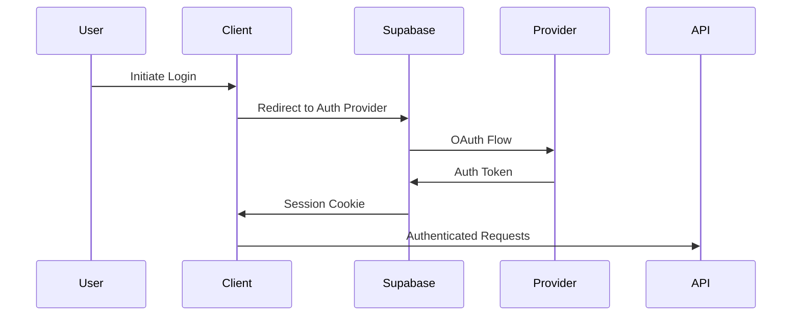

# NextJS Gallery Architecture

## Core Stack
- **Next.js 14** (App Router)
- **TailwindCSS** with JIT compiler
- **Supabase** for:
  - Authentication (OAuth + Email)
  - PostgreSQL Database
  - Storage (S3 compatible)
- **Payment Processors**:
  - Stripe (Credit Cards)
  - PayPal (Alternative payments)
  - Crypto (Coinbase Commerce)

## Key Architectural Decisions

### 1. Authentication Flow

### 2. Payment Processing
- PCI DSS Compliance:
  - No raw payment data handled
  - Stripe Elements for secure card entry
  - Webhook verification for all transactions

### 3. Image Processing Pipeline
1. Upload to Supabase Storage
2. Generate thumbnails via Supabase Transformations
3. Store metadata in PostgreSQL
4. Apply row-level security policies

## Performance Considerations
- ISR for gallery pages
- Edge caching for images
- Database indexing strategy
